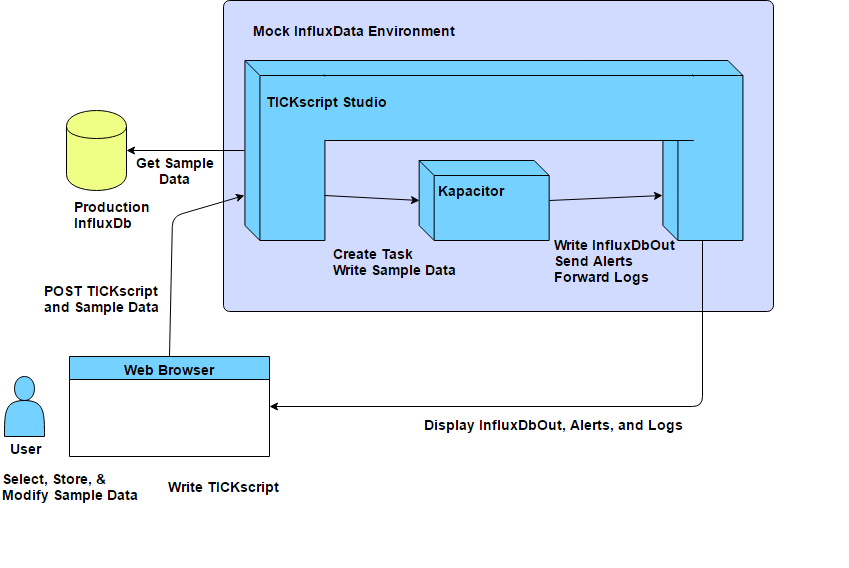

##tickscript studio


Tickscript Studio is a hacky and simple IDE for developing and testing TICKscripts. It consists of a server-side application written in Go, and a single page app written with Angular 1.4 and built with systemjs-bundle.

It is meant to be run in docker along with a dedicated instance of kapacitor. It provides input to kapacitor, and then reads kapacitor's output and presents it to the user.

Currently it does not support an external kapacitor server since it wants to be able to read/truncate kapacitor's log file.

## diagram



## deploying using docker-compose

* Edit the `docker-compose.yml` file: set the TICKSCRIPT_STUDIO_INFLUXDB environment variables correctly for your influxdb server.
* `docker-compose up -d`

##developing on this project

#### Development Pre-requisites

  * [graphviz](http://www.graphviz.org/Download..php) `dot` installed and on your `$PATH`. (`dot -V` returns successfully)
  * golang installed and available (`go run ...`)
  * node.js installed.

#### first time local build and run process

First set up the app. Please note that this DOES have to be inside your $GOPATH because the go tools still insist on it.

```
mkdir -p $GOPATH/src/github.com/sequentialread
cd $GOPATH/src/github.com/sequentialread
git clone https://github.com/sequentialread/tickscript-studio.git
cd tickscript-studio
go get ./server
npm install
jspm install
```

(If any of those commands are missing, you could probably `npm install -g jspm` or `npm install -g gulp`)

Now, you will have to configure the app for your environment. tickscript-studio has two configuration files. `config-local.json` will be used when running the application locally in debug mode via `gulp`.

`config-deploy.json` will be merged on top of `config-local.json` when building a docker image of the application via `./build.sh 0.0.0`

You will have to set some configuration variables in `config-local.json`. You should notice that currently this file contains example data. Look for:

* `influxDbHost`
** this is the hostname and port of your influxDb server
* `kapacitorHost`
** this is the hostname and port of your kapacitor instance. This should be the hostname or IP of your docker machine and port 9092
* `kapacitorLogFolder`
** this is the path on your machine where the kapacitor logs can be accessed. If you are running kapacitor in Docker it must match the volume your mount for the container.
* `bashPath`
** path to the bash executable. On windows it will be `C:/Program Files/Git/bin/bash.exe` 90% of the time. On Mac and Linux it should be `/bin/bash`
** this is used to run `clearFile.sh` to clear the kapacitor log file.

Finally, set up Kapacitor. This assumes that you have docker installed via the Docker Toolbox with default settings.
(I have only tested this so far with Docker Toolbox on windows)

```
docker-machine ssh

DOCKER_ROUTE_TO_HOST=$(ip route show 0.0.0.0/0 | grep -Eo 'via \S+' | awk '{ print $2 }') \
  && docker run --rm --name="kapacitor" \
    -p "9092:9092" \
    -e "KAPACITOR_LOGGING_FILE=/var/log/kapacitor/kapacitor.log" \
    -e "KAPACITOR_HOSTNAME=kapacitor" \
    -e "KAPACITOR_INFLUXDB_0_URLS_0=http://tickscriptstudio:8081/" \
    -e "KAPACITOR_INFLUXDB_0_DISABLE_SUBSCRIPTIONS=true" \
    -e "KAPACITOR_SLACK_ENABLED=true" \
    -e "KAPACITOR_SLACK_URL=http://tickscriptstudio:8081/alert" \
    -e "KAPACITOR_SLACK_GLOBAL=true" \
    --add-host="tickscriptstudio:$DOCKER_ROUTE_TO_HOST" \
    -v "/c/Users/username/Desktop/kapacitor-logs:/var/log/kapacitor" \
    kapacitor:1.0.1
```

This command will record the IP of your host machine from the docker-machine's perspective, then it will start an instance of kapacitor configured to talk to your host machine on port 8081.

You will have to change the host side of the mounted directory `/c/Users/username/Desktop/kapacitor-logs` to match whatever you set as your `kapacitorLogFolder` in the config file.

If you want your kapacitor container to run in detached mode and stick around when you turn off your machine, then use  `docker run -d ` instead of `docker run --rm `. After you restart your computer you will have to `docker start kapacitor`.

Finally, at long last, to run the app, simply type `gulp`. Once the application appears in your browser window, any edits to the source files should automatically build and the browser should automatically reload.

If you need an influxdb locally, you can create a docker container with:

```
docker run -d --name="influxdb" -p "8086:8086" -p "8083:8083" influxdb:1.0.1
```

#### Troubleshooting

JavaScript errors and HTTP errors should be logged to the console.
